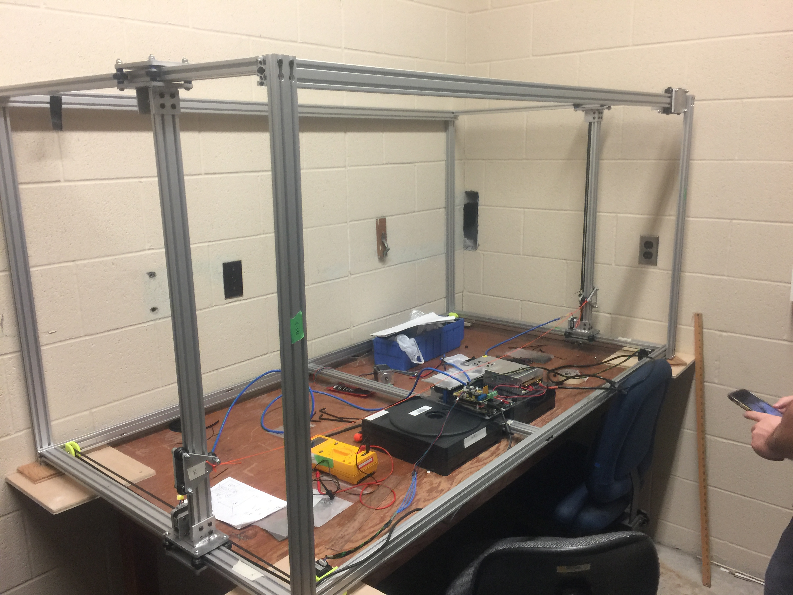

# Advanced Aircraft Design Laboratory CNC Airfoil Cutter

* Frame Design:
* 4020 Al extrusion, tapped on ends with ???
Length: 1.5m, Width: 1.0m, Height: 1.0m. 

* Brains:
* Stepper Drivers:
* Strepper Motors:
* Power Supply: 

